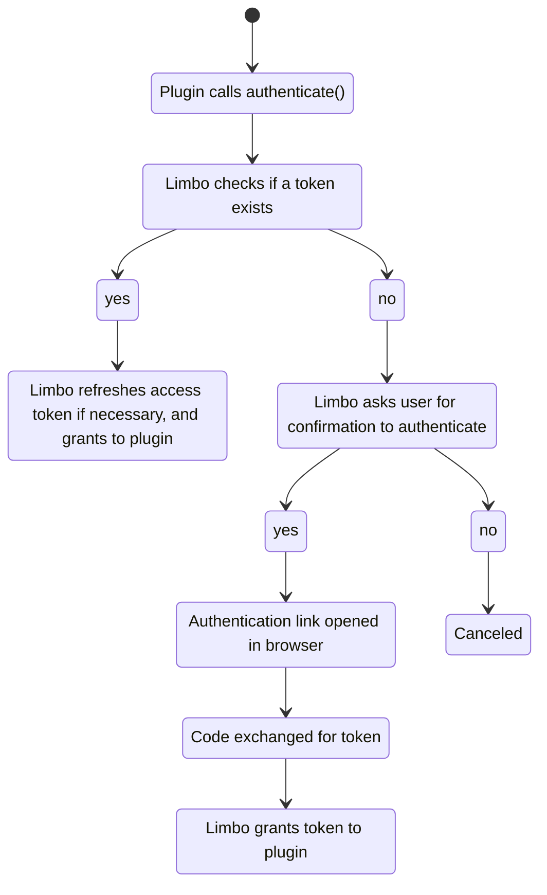

The Limbo API has support for OAuth2.1 authentication with PKCE.

Plugins are able to initiate an authentication session to connect to a third-party service on behalf of the user.

:::note
The MCP plugin uses the Limbo authentication API to authenticate with MCP servers.
:::

## The Flow

Here's an overview of how the authentication API works.



## Usage

With the Limbo authentication API, most of the heavy lifting is done for you.

You don't need to worry about:

- managing/storing access and refresh tokens
- refreshing access tokens (Limbo does it for you!)

The `limbo.auth.authenticate` function will either:

- return the access token upon success
- throw an error if authentication fails (usually when a user cancels or the session expires)

```ts
// with an OAuth client registered already
const accessToken = await limbo.auth.authenticate({
	authUrl: "https://test.com/oauth/authorize",
	tokenUrl: "https://test.com/oauth/token",
	clientId: "my_client_id",
	scopes: ["DO_SOMETHING"],
});
```

## Dynamic Client Registration

Limbo supports [dynamic client registration (DCR)](https://datatracker.ietf.org/doc/html/rfc7591), which allows Limbo to register a new OAuth client dynamically.

### Example

This is actually how the MCP plugin works; it has to register a client dynamically.

In order to demonstrate DCR, we will use some code from the MCP plugin as an example.

Things to notice:

- We provide a descriptive client name for the OAuth provider
- We pass the `registration_url`
- We do not need to provide a `client_id` since it will be created dynamically

```ts
// plugin.ts

const accessToken = await limbo.auth.authenticate({
	clientName: "Limbo MCP",
	registrationUrl: "https://test.com/oauth/register", // side note, the MCP plugin discovers the registration URL from the MCP server
	authUrl: "https://test.com/oauth/authorize",
	tokenUrl: "https://test.com/oauth/token",
	scopes: ["DO_SOMETHING"],
});
```
