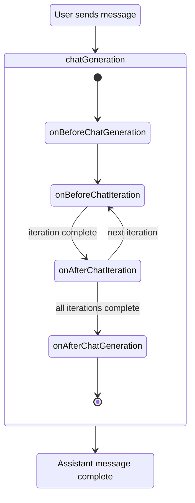

There are several lifecyles that plugins can hook into.

## Activation

The main lifecyles of a plugin are the **activation** and **deactivation** lifecycles.

When a plugin is activated, the `onActivate` function is called.

When a plugin is deactivated, the `onDeactivate` function is called.

### Example

Here's an example of the `onActivate` and `onDeactivate` functions in action.

```ts
// plugin.ts

import * as limbo from "@limbo-chat/api";

export default {
	onActivate: async () => {
		console.log("Plugin activated!");

		// this is where things like llms, tools, and commands should be registered
	},
	onDeactivate: async () => {
		console.log("Plugin deactivated!");

		// this is where any cleanup should occur if needed.
		// any entities registered such as LLMs, tools, and commands will automatically be unregistered.
	},
} satisfies limbo.Plugin;
```

## Chats

There are also several lifecycle hooks around the creation and deletion of chats.

```ts
// plugin.ts

import * as limbo from "@limbo-chat/api";

export default {
	// called when a new chat is created
	onChatCreated: (newChat) => {
		console.log("chat created:", newChat);
	},
	// called when a single chat is deleted
	onChatDeleted: (chatId) => {
		console.log("chat deleted:", chatId);
	},
	// called when multiple chats are deleted at once
	onChatsDeleted: (chatIds) => {
		console.log("chats deleted:", chatIds);
	},
} satisfies limbo.Plugin;
```

## Chat Generation

A **chat generation** refers to the process of generating a single response (AKA, an assistant message) to the user's message. A chat generation consists of one or more **iterations**.

A **chat iteration** is essentially each individual call to an LLM. If an iteration results in a tool call, another chat iteration will be enqueued to then generate the response.

Although there may be multiple iterations, they are all grouped under one **generation**.

:::tip
Chat Generations are one of the most significant parts of Limbo.
:::

Here is a diagram representing the chat generation lifecycle:



### Example

Here's an example of the chat generation lifecycle hooks in action.

```ts
// plugin.ts

import * as limbo from "@limbo-chat/api";

export default {
	onBeforeChatGeneration: ({ generation }) => {
		console.log("Before chat generation");
	},
	onBeforeChatIteration: ({ generation, iteration }) => {
		console.log("Before chat iteration", iteration);
	},
	onAfterChatIteration: ({ generation, iteration }) => {
		console.log("After chat iteration:", iteration);
	},
	onAfterChatGeneration: ({ generation }) => {
		console.log("After chat generation");
	},
} satisfies limbo.Plugin;
```
